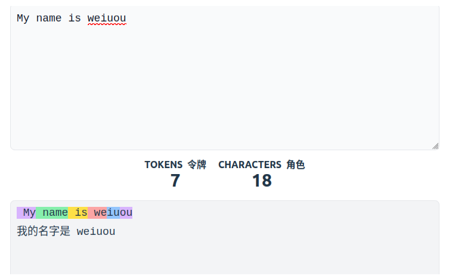

## 什么是LLM

一个LLM是一种擅长理解和生成人类语言的AI模型，它们在大量文本数据上进行训练，从而能够学习语言的模式、结构甚至细微差别。这些模型通常包含数百万个参数。

大多数LLM都是基于Transformer架构构建的——这是一种基于“注意力”算法的深度学习架构。
### Transformer
Transformer模型中包含三种类型
1. Encoder编码器
    - 基于编码器的Transformer将文本作为输入，并输出该文本的密集表示
    - 使用场景：文本分类、语义搜索、命名实体识别
2. Decoder解码器
    - 基于解码器的Transformer专注于逐个生成新标记以完成序列
    - 使用场景：文本生成、聊天机器人、代码生成
3. Seq2Seq（编码器-解码器）
    - 一个序列到序列的Transformer，结合了编码器和解码器。首先将输入序列处理成上下文表示，然后解码器生成输出序列
    - 使用场景：翻译、摘要、释义

LLM通常是基于解码器的模型，以下是一些著名LLM

|模型|提供方|
|:-:|:-:|
|Deepseek-R1|DeepSeek|
|GPT4|OpenAI|
|Llama3|Meta|

### LLM基本原理
LLM的基本原理简单而高效：根据先前令牌（Token）来预测下一个令牌，“令牌”是LLM处理信息的单元，可以把令牌想象成一个字或者一个词。

例如将“开”和“车”两个字组合成“开车”或者将“开”和“心”组成“开心”

图中为对`My name is weiuou`这句话拆分为Token之后的样子

### LLM特殊标识
每个LLM都有一些特定于该模型的特殊标记。LLM使用这些标记来打开和关闭其生成中的结构化组件。例如用于指示序列、消息或响应的开始或结束。其中最重要的是序列结束标记（EOS）

特殊标记的形式在模型提供商之间高度多样化。

### LLM的预测
LLM被称为自回归的，意味着这一次的输出会成为下一次迭代的输入，直到预测下一个标记为EOS为止，此时模型停止。

在单个解码循环中，输入文本被分词，成为Token序列，模型计算每个Token在序列中的意义和位置，然后对每个Token作为下一个标记的可能性进行排序，然后进行填充，对于这些可能性的评分，有多重策略来选择下一个填充句子的Token

1. 最简单的解码策略是始终选择得分最高的标记
2. 选择具有最大总分的序列（即使某些标记的分数较低）

ps：读到这里是不是想到一些简单算法题里面贪心和动态规划的区别（全局最优、局部最优）？

#### 注意力机制
Transformer架构的关键方面是注意力机制。在预测单词时，句子中的每个单词并不同等重要，比如`我的名字叫Weiuou`中`名字`这个词承载了最多的意义。

换句话说就是在原本简单的算法题上又加了点贡献法的内容

常用LLM的小伙伴可能知道“上下文长度”这个词，它指的就是LLM可以处理的最大Token序列长度以及它的最大注意力范围

#### 提示词
考虑到LLM的任务三通过对每个输入的Token来进行观察，来预测后面的Token，并选择哪些Token是更有意义的，因此输入序列对LLM输出的影响是十分大的。

用户提供的输入序列被称为提示（prompt）一个优秀的提示往往更能引导LLM生成所需的内容

### 如何训练LLM
- 在大文本数据集上训练，通过自监督或掩码语言建模的目标学习预测序列中的下一单词
- 从无监督学习中，学习语言的结构和文本中的潜在模式，使模型能够推广到未见过的数据
- 在以上的初始预训练后，LLM可以在监督学习目标上进行微调以执行特定任务。比如一些模型用于对话，而另一些用于代码生成

### 如何使用LLM
- 本地运行，这通常需要更好的硬件
- 使用API

### AI代理中如何使用LLM

- AI代理的关键组成部分，为理解和生成人类语言提供基础。
- 理解用户指令，在对话中保持上下文，并计划使用哪些工具

