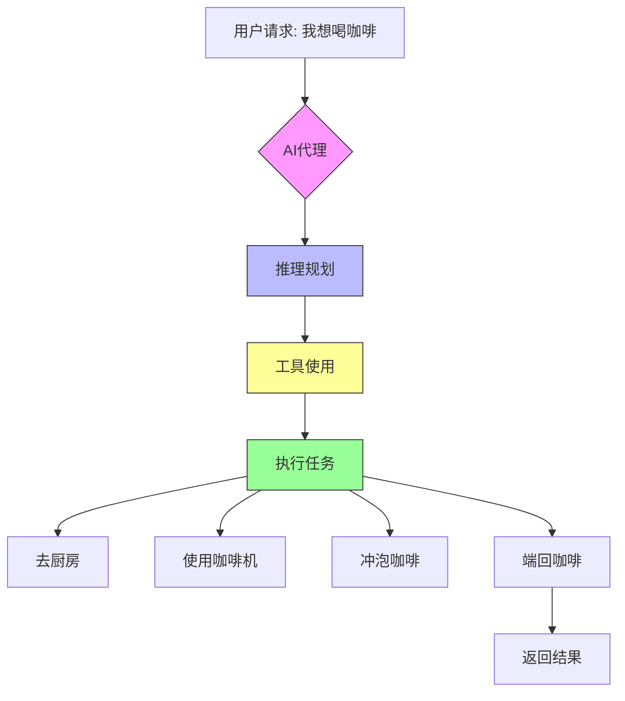
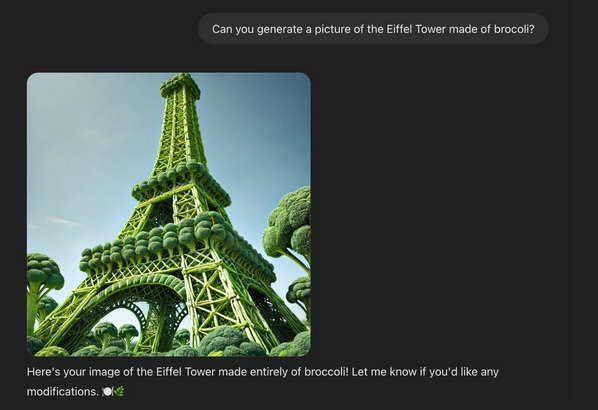

## 什么是AI代理
假如你向`weiuou`说：“我想喝一杯咖啡”，然后weiuou迅速的理解了你的需求，然后进行了一系列推理和规划，来确定他需要干什么

1. 去厨房
2. 使用咖啡机
3. 冲泡咖啡
4. 把咖啡端回来

有了以上的计划，他开始使用工具，他激活咖啡机来煮咖啡。最后，他把一杯咖啡端给了你。这就是一个代理：能够推理，规划和与其环境交互的AI模型。

**我们给出更加准确的正式的定义**：AI代理（智能体）是一种利用AI模型与环境交互以实现用户定义目标的系统。它结合推理、规划和执行动作来完成任务。

上图由AI生成

## AI代理的组成
### 大脑（AI模型）

我们为代理使用的最常见的模型是LLM（大型语言模型）以文本作为输入并输出文本，此外还有能接受其他类型输入的模型，例如VLM（视觉语言模型）类似于LLM，但也能理解图像作为输入

### 身体（能力和工具）

LLM虽然非常有用，但是他们只能生成文本，然而如果你要求`ChatGPT`这样的知名AI应用生成一张图片，他也是可以做到的。这是不是和上面“只能生成文本”相悖呢？答案是否定的，开发者实现了额外的功能，称为工具，LLM可以使用这些工具来创建图像

这样一来，AI代理能使用的工具越多，也就意味着它们能执行的任务也就越多，允许AI代理与环境交互就能实现AI代理在现实生活中的应用。
例如

- 个人虚拟助手
- 客服聊天机器人
- 游戏中更加灵活、更加不可预测的NPC

## 总结

AI代理是一个系统，它使用一个AI模型作为大脑，通常是LLM来做到以下工作

1. 理解自然语言
2. 分析信息做出决策
3. 使用工具与环境交互
