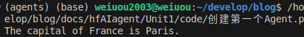
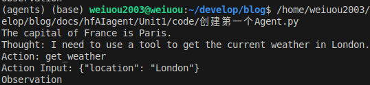
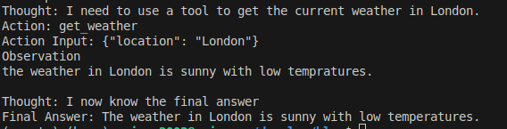

## 创建第一个Agent
在熟悉了Agent的工作原理之后，我们开始动手创建第一个Agent，Huggingface上用了他们的一个`Dummy Agent Library`虚拟代理库，由于我并没有提前申请，所以只能用本地的或者网上免费的API做实验，这里我选了硅基流动的API平台。

*模型选择上我建议选择更小的模型，因为我在做本节实验的过程中一开始用的`8B`模型很难向书中那样出现幻觉，所以后面改为`1.5B`模型，出现幻觉的频率明显有所提高*

首先封装了一个chatAPI类，用来向硅基流动的服务器发送请求（当然这也是我用AI生成的代码）
```Python
class ChatAPI:
    def __init__(self, token=None):
        self.url = "https://api.siliconflow.cn/v1/chat/completions"
        self.headers = {
            "Authorization": f"Bearer {token}" if token else "Bearer <token>",
            "Content-Type": "application/json"
        }
        self.payload = {
            "model": "Qwen/Qwen2-1.5B-Instruct",
            "messages": [],
            "stream": False,
            "max_tokens": 512,
            "stop": ["null"],
            "temperature": 0.7,
            "top_p": 0.7,
            "top_k": 50,
            "frequency_penalty": 0.5,
            "n": 1,
            "response_format": {"type": "text"}
        }

    def set_model(self, model):
        self.payload["model"] = model
        return self

    def add_message(self, role, content):
        self.payload["messages"].append({"role": role, "content": content})
        return self

    def set_stream(self, stream):
        self.payload["stream"] = stream
        return self

    def set_max_tokens(self, max_tokens):
        self.payload["max_tokens"] = max_tokens
        return self

    def set_temperature(self, temperature):
        self.payload["temperature"] = temperature
        return self

    def set_top_p(self, top_p):
        self.payload["top_p"] = top_p
        return self

    def set_stop_sequences(self, stop):
        self.payload["stop"] = stop
        return self

    def send_request(self):
        response = requests.post(
            self.url,
            json=self.payload,
            headers=self.headers
        )
        return response.json()['choices'][0]['message']['content']
```

然后先发送测试请求
```Python
def firstTry():
    # 初始化并设置参数
    chat = ChatAPI("<YOUR-APIKEY-HERE>") \
        .add_message("system","")\
        .add_message("user", "the capital of france is") \
        .set_max_tokens(512)
    
    # 发送请求并打印结果
    result = chat.send_request()
    print(result)
```



证明我们的API是可用的，代码以及服务器没什么大的问题，然后开始添加我们的第一个Agent，询问伦敦的天气

```Python
def AddAgent():
    SYSTEM_PROMPT = """
The way you use the tools is by specifying a json blob.
Specifically, this json should have an `action` key (with the name of the tool to use) and an `action_input` key (with the input to the tool going here).

The only values that should be in the "action" field are:
get_weather: Get the current weather in a given location, args: {'location': {'type': 'string'}}
example use : 

{{
  "action": "get_weather",
  "action_input": {{"location": "New York"}}
}}

ALWAYS use the following format:

Question: the input question you must answer
Thought: you should always think about one action to take. Only one action at a time in this format:
Action:

$JSON_BLOB (inside markdown cell)

Observation: the result of the action. This Observation is unique, complete, and the source of truth.
... (this Thought/Action/Observation can repeat N times, you should take several steps when needed. The $JSON_BLOB must be formatted as markdown and only use a SINGLE action at a time.)

You must always end your output with the following format:

Thought: I now know the final answer
Final Answer: the final answer to the original input question

Now begin! Reminder to ALWAYS use the exact characters `Final Answer:` when you provide a definitive answer.
"""
    chat = ChatAPI("YOUR-APIKEY-HERE")\
        .add_message("system",SYSTEM_PROMPT)\
        .add_message("user","What's the weather in London?")\
        .set_max_tokens(2048)\
    result = chat.send_request()
    print(result)
```

这部分主要是使用Huggingface上给你写好的system_prompt进行测试，发现模型确实能够按照要求的格式来进行回答的生成


但是我们发现，它在还没调用工具的时候，就已经给出了观测结果（出现了幻觉），这时候我们就要在它出现幻觉之前及时的打断他，并将正确的观测结果告诉它

```python
chat = ChatAPI("YOUR-APIKEY-HERE")\
        .add_message("system",SYSTEM_PROMPT)\
        .add_message("user","What's the weather in London?")\
        .set_max_tokens(2048)\
        .set_stop_sequences("Observation:")
    result = chat.send_request()
    print(result)
    new_prompt = result+get_weather('London')
    print(get_weather('London'))
    chat.add_message("assistant",new_prompt)
    result = chat.send_request()
    print(result)
```


打断的效果
```python
def get_weather(location):
    return f"the weather in {location} is sunny with low tempratures. \n"
```
这里定义一个假的函数，来模拟真实请求


最终效果

实现这样一个代理还是挺有意思的，我之前也有一个~~QQ机器人~~项目，可能以后会考虑完善一下功能（画饼）