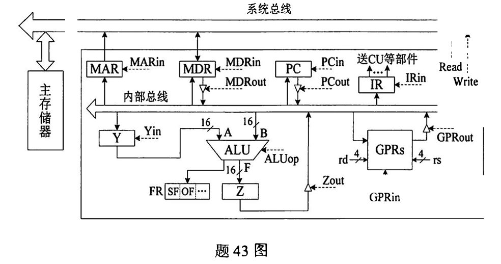

# 计组真题
## 2022年
## 选择

## 大题

### 43. 
**某CPU中部分数据通路如题43图所示，其中，GPRs为通用寄存器组；FR为标志寄存器，用于存放ALU产生的标志信息；带箭头虚线表示控制信号，如控制信号 Read、Write分别表示主存读、主存写,MDRin表示内部总线上数据写入MDR,MDRout表示MDR的内容送内部总线。**

请回答下列问题。

1. 设ALU的输入端A、 B及输出端F的最高位分别为$A_{15}$、$B_{15}$及$F_{15}$, FR中的符号标志和溢出标志分别为SF和OF, 则SF的逻辑表达式是什么？A加B、A减B时OF的逻辑表达式分别是什么？要求逻辑表达式的输入变量为$A_{15}$、$B_{15}$及$F_{15}$
    - **answer** [数的运算](../第二章/整数的表示.md):
        - SF = $F_{15}$ ；SF是符号标志，输出的F的最高位为符号位
        - $A+B=F$当AB为正，F为负或者AB为负，F为正发生溢出 $$OF = \overline{A_{15}} \And \overline{B_{15}}\And F_{15}  |  A_{15}\And B_{15}\And \overline{F_{15}} $$
        - $A-B=F$ A为负B为正，F为正发生溢出；A为正B为负，F为负发生溢出 $$OF = A_{15} \And \overline{B_{15}}\And F_{15}  |  A_{15}\And \overline{B_{15}}\And \overline{F_{15}} $$
2. 为什么要设置暂存器Y和Z?
    - **answer**:
        - 每一时刻数据总线只能传输一个数据，ALU需要2个输入数据，第一个数据暂存在Y中。
        - ALU产生运算结果时，数据总线可能被占用，需要用暂存器Z临时存储。
3. 若GPRs的输入端rs、rd分别为所读、写的通用寄存器的编号，则GPRs中最多有多少个通用寄存器？rs和rd来自图中的哪个寄存器？已知GPRs内部有一个地址译码器和一个多路选择器，rd应连接地址译码器还是多路选择器？
    - **answer**:
        - rs、rd都为4位，则寄存器数量最多为$2^4=16$个，rd和rs都来自IR（指令寄存器）rd表示寄存器编号，连接地址译码器
4. 取指令阶段（不考虑PC增量操作） 的控制信号序列是什么？若从发出主存读命令到主存读出数据并传送到MD R共需5个时钟周期， 则取指令阶段至少需要几个时钟周期？
    - **answer** [取指周期](..)：
        - PC(PCout)->(MARin)MAR->地址总线->存储器
        - CU发出读命令->控制总线->存储器
        - 主存->数据总线(Read)->(!MDRin⚠此处为数据总线到MDR，非题目描述的MDRin为内部总线到MDR，因此不是MDRin)MDR(MDRout)->(IRin)IR
        - CU发出控制信号->PC内容+1
        - 则控制信号序列为：PCout -> MARin(1时钟周期) => Read(5时钟周期) => MDRout -> IRin(1时钟周期)共7时钟周期
5. 图中控制信号由什么部件产生？图中哪些寄存器的输出信号会连到该部件的输入端？
    - **answer**：
        - 控制信号由CU（控制部件）产生，IR（指令寄存器），FR（标志寄存器）的输出信号会连接到该控制部件的输入端