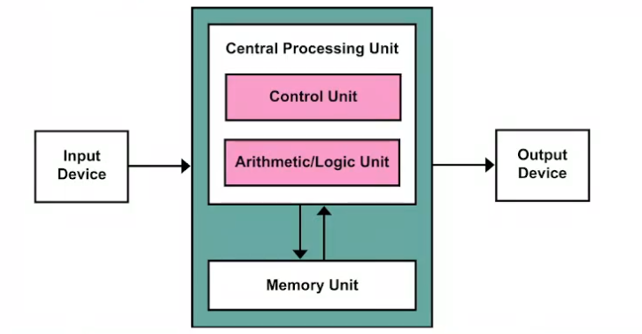
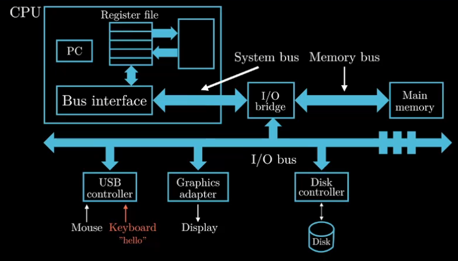
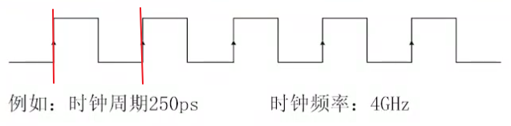
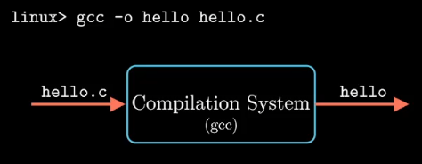
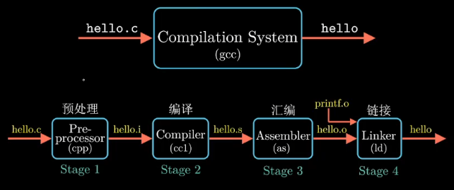

# 计算机系统概述
## 冯诺依曼架构

## 计算机硬件
- CPU
- 内存
- 磁盘/硬盘

## 性能

- 响应时间（对于单个用户）：计算机完成某个任务所需要的总时间
- 吞吐率（对于服务器）：也叫带宽，表示单位时间内完成任务的数量

⚠ 为使性能最大化，我们希望任务的响应时间或者执行时间最小化:

- 性能 = 1 / 执行时间

⚠ 两台计算机A比B快多少

- 性能A/性能B = 执行时间B/执行时间A = x
- A是B的x倍快
## 时钟频率(主频)

- 时钟周期：时钟间隔的时间
- 时钟频率：每秒多少个时钟周期

倒数关系 



1s = 10^3ms = 10^6us = 10^9ns = 10^12ps
## CPI性能公式

- CPI（平均执行每条指令所需要的时钟周期数）
    - CPU时间 = 指令数 * CPI * 时钟周期时间
    - 时钟周期时间 = 1 / 时钟频率
    - CPU时间 = 指令数 * CPI / 时钟频率
- MIPS(每秒执行多少百万条指令数)
    - MIPS = 指令数 / (执行时间 * 10^6)
    - MIPS = 时钟频率 / (CPI *  10^6)
- FLOPS(每秒执行多少次浮点操作)
    - MFLOPS
    - GFLOPS
    - TFLOPS
    - PFLOPS
## 程序从高级语言到机器指令的过程
```C++
#include<stdio.h>

int main(){

    printf("hello World!\n");
    return 0;
}
```
一段C语言的helloworld程序（高级语言）



经过编译系统形成可执行程序


- 预处理生成hello.i
    - ```cpp -o hello.i hello.c```
    - ```gcc -E -o hello.i hello.c```
- 编译生成hello.s(汇编程序)
    - ```cc -S -o hello.s hello.i```
    - ```gcc -S -o hello.s hello.i```
- 汇编器生成hello.o（二进制可重定位目标文件）
    - ```as -o hello.o hello.s```
- 链接生成可执行程序 hello
    - ```./hello```
