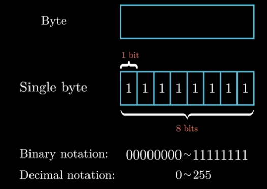

## 整数的存储
### 字节

- 1字节=8比特
- 1字节可以保存2^8 = 256种数据
### 十六进制
|2      |10     |16     |
|:---:  |:---:  |:---:  |
|1      |1      |1      |
|10     |2      |2      |
|11     |3      |3      |
|100    |4      |4      |
|101    |5      |5      |
|110    |6      |6      |
|111    |7      |7      |
|1000   |8      |8      |
|1001   |9      |9      |
|1010   |10     |A      |
|1011   |11     |B      |
|1100   |12     |C      |
|1101   |13     |D      |
|1110   |14     |E      |
|1111   |15     |F      |

## 无符号数
## 有符号数（补码）

最高位是负权，其余位和无符号数一样

- 例如一字节表示的有符号数的范围是`-128 ~ 127`

⭐ 二进制1011表示的无符号数、有符号数

- 无符号数`1011 = 1 * 2^0 + 1 * 2^1 + 0 * 2^2 + 1 * 2^3 = 11`
- 有符号数`1011 = 1 * 2^0 + 1 * 2^1 + 0 * 2^2 + 1 * (-2^3) = -5`
- 表示的数值偏差为16，也就是2^4(位数)
- -1的表示：在有符号数中，-1的表示应为全1

## 溢出
- `x>=0, y>=0`
    - `x + y < 0`正溢出
- `x<=0, y<=0`
    - `x + y > 0`负溢出

## 大端法、小端法

**以0x01234567为例**

### 大端法

|地址|0x100|0x101|0x102|0x103|...|
|---|---|---|---|---|---|
|数据|01|23|45|67|...|

### 小端法

|地址|0x100|0x101|0x102|0x103|...|
|---|---|---|---|---|---|
|数据|67|45|23|01|...|

## 移位

- 左移（相当于*2）
    - 左移操作在末尾补0
    - 高位表示不下的自动溢出
- 右移（相当于/2）
    - 无符号数右移补0，低位溢出（ **逻辑右移** ）
    - 有符号数右移补符号位，低位溢出（ **算数右移** ）

⭐ **计算乘法**
例如`x * 14`

- 14 = 2^3 + 2^2 + 2^1
    - x * 14 = (x<<3) + (x<<2) + (x<<1)
- 14 = 2^4 - 2^1
    - x * 14 = (x<<4) - (x<<2)
